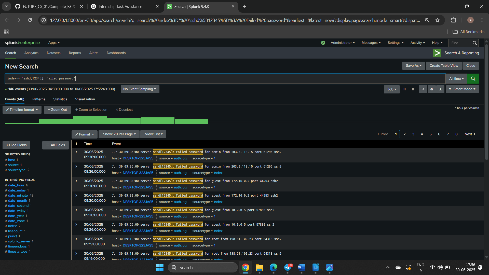
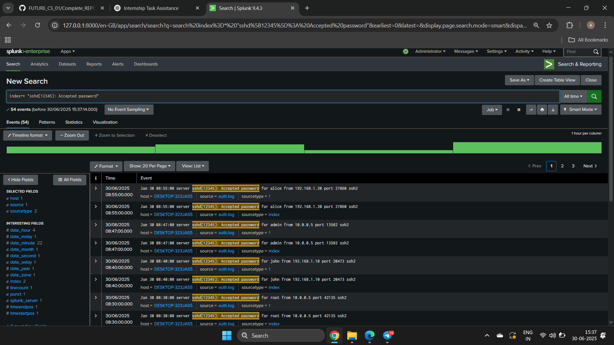

# 🛡️ Security Alert Monitoring Report – Splunk SIEM  
*(Internship Simulation Task)*

---

## 📌 Project Title:  
**Security Incident Detection and Analysis Using Splunk SIEM**

### 👨‍💻 Internship Program:  
**Future Interns – Cybersecurity Internship**  
Conducted by *Future Interns*

### 🧑‍🎓 Intern Name:  
**Aman Patel**  
Cybersecurity & Ethical Hacking Enthusiast

### 🧰 Tools & Technologies Used:
- 🖥️ Splunk Enterprise (Local Setup – Windows MSI)
- 🐧 Simulated Linux Logs (`auth.log`, `syslog`, `network_connections.log`)
- 🧪 Log Sources: Authentication, Network & System Events
- 📸 Screenshots captured from Splunk Search & Reporting
- 📝 Report compiled using Microsoft Word

### 🗓️ Assessment Date:  
29th June 2025

### 🌍 Test Environment:
- Host Machine: Windows 11  
- Splunk Indexing Source: Manually uploaded `.log` files  
- Simulated Environment: Local (Standalone Analysis)

---

## 🧾 Executive Summary

This report presents the findings from a simulated **Security Operations Center (SOC)** exercise conducted as part of the *Future Interns Cybersecurity Internship Program*. The objective was to demonstrate the intern's ability to detect, analyze, and classify potential security incidents using a real-world SIEM tool – **Splunk Enterprise**.

Three key log sources were ingested and examined:
- Authentication Logs (`auth.log`)
- Network Connection Logs (`network_connections.log`)
- System Logs (`syslog.log`)

After processing the data in Splunk, a set of **security alerts were identified**, each indicating potentially malicious behavior. These included **brute-force login attempts**, **unauthorized RDP access**, and **execution of suspicious system-level commands**. Each alert was triaged based on severity and analyzed for threat context, indicators, and recommended mitigation steps.

This simulation highlights the importance of **proactive log monitoring**, **real-time alerting**, and a **structured incident response** process within a modern SOC environment.

---

## 🌐 Scope of Assessment

The objective of this assessment was to simulate the responsibilities of a **Security Operations Center (SOC) analyst** by detecting and analyzing security alerts using Splunk SIEM.

### 🔎 Log Sources Analyzed:
- `auth.log` – Authentication attempts (success & failure)
- `network_connections.log` – Connection attempts to internal/external IPs
- `syslog.log` – System-level command executions and user behavior

### 🧰 Platform & Tools Used:
- Splunk Enterprise (Standalone Setup on Windows 11)
- Manual log ingestion via file upload
- Custom simulated log files generated for realistic SOC scenarios

### 🎯 Assessment Goals:
- Identify and classify security alerts (e.g., brute-force, unauthorized access)
- Correlate events using Splunk queries
- Evaluate risks and recommend mitigations
- Present findings in a structured report with severity levels

---

## 🚨 Incident Summary Table

| Incident # | Type of Alert                  | Severity | Description                                                                     | Recommended Action                                                         |
|------------|--------------------------------|----------|---------------------------------------------------------------------------------|----------------------------------------------------------------------------|
| 1          | SSH Brute-Force Attempt        | High     | Multiple failed login attempts from IP `203.0.113.15`                          | Block IP, enable rate limiting, enforce 2FA                                |
| 2          | Blocked RDP Port Access        | High     | Unauthorized connection attempt to port `3389` (RDP)                           | Investigate source, verify firewall, disable unused services               |
| 3          | Suspicious Command Execution   | Medium   | User `alice` ran `wget`, suggesting unapproved external download               | Restrict commands, enforce sudo policy, monitor usage                      |
| 4          | Multiple Successful Logins     | Medium   | Multiple successful logins from same external IP to different users            | Investigate credential reuse, check for compromise                         |
| 5          | Unusual Port Access Attempt    | Medium   | Firewall logs show attempts to access ports like `8080`, `3389`                | Monitor ports, enforce firewall rules, alert on scans                      |

---

## 🔍 Detailed Findings

### 🛑 Incident 1: SSH Brute-Force Attempt
- **Screenshot Reference :**   
- **Splunk Query :**
  ```spl
  index=* "sshd[12345]: Failed password"
  ```
- **Sample Log**
```
sshd[12345]: Failed password for john from 203.0.113.15 port 10587 ssh2
```
- **Analysis :**
Multiple failed SSH login attempts from an external IP suggest a brute-force attack.

- **Severity :** High

- __*Recommended Action :*__
Block the IP, enable account lockout, and enforce 2FA.

--- 

### 🔐 Incident 2: Blocked RDP Port Access

**Screenshot Reference:** 

**Splunk Query:**
```spl
index=* "firewall: Connection" "BLOCKED"
```
- **Sample Log**
```
firewall: Connection from 198.51.100.23 to 192.168.1.10 on port 3389 BLOCKED
```
- **Analysis :**
Connection to the RDP port was blocked, likely indicating reconnaissance or unauthorized access attempts.

- **Severity :** High

- __*Recommended Action :*__
Investigate IP, enforce access controls, disable unneeded services.

---

### ⚠️ Incident 3: Suspicious Command Execution
- **Screenshot Reference :** 

- **Splunk Query :**
```spl
index=* ("sudo" OR "wget" OR "curl")
```
- **Sample Log :**
```pgsql
server: User alice ran command: wget
```
- **Analysis :**
Use of wget by a non-admin could indicate an attempt to download untrusted files.

- **Severity :** Medium

- __*Recommended Action :*__
Limit such commands via sudoers, monitor logs, educate users.

--- 

### 👀 Incident 4: Multiple Successful Logins from Same IP
- **Screenshot Reference :** 

- **Splunk Query :**
```spl
index=* "sshd[12345]: Accepted password"
```
- **Sample Log :**
```pgsql
sshd[12345]: Accepted password for david from 203.0.113.15 port 11245 ssh2
```
- **Analysis :**
Multiple logins from a single IP to various accounts suggest possible credential reuse or breach.

- **Severity :** Medium

- __*Recommended Action :*__
Audit credentials, enforce MFA, alert on anomalies.

---

### 🌐 Incident 5: Unusual Port Access Attempts
- **Screenshot Reference :** 

- **Splunk Query :**
```spl
index=* "BLOCKED" OR "Connection" AND port!=80 AND port!=443
```
- **Sample Log :**
```vbnet
firewall: Connection from 192.0.2.14 to 10.0.0.5 on port 8080 BLOCKED
```
- **Analysis :**
Access attempts to uncommon ports may indicate scanning or discovery efforts.

- **Severity :** Medium

- __*Recommended Action :*__
Harden unused ports, set alerts, conduct routine reviews.

---

  ## ✅ Recommendations

### 🔐 1. Strengthen Authentication Controls
- Enforce account lockout policies  
- Enable 2FA for remote and critical accounts  
- Monitor logins from new IPs  

### 🔥 2. Harden Network & Firewall Settings
- Block unused ports (e.g., 8080, 3389)  
- Use IP allowlists for sensitive access  
- Monitor and alert on blocked attempts  

### 🛡️ 3. Apply Least Privilege & Command Controls
- Restrict usage of `wget`, `curl`, etc.  
- Review sudoer policies regularly  
- Track and log command-line behavior  

### 📈 4. Enable Continuous Monitoring
- Set up Splunk alerts for common attack patterns  
- Automate anomaly detection  
- Conduct regular log audits  

### 📋 5. Improve Incident Response Readiness
- Regularly update playbooks and firewall rules  
- Run internal red team/tabletop simulations  
- Document and rehearse response steps  

---

## 🧾 Conclusion

This assessment successfully replicated a real-world **SOC workflow**, showcasing detection and response skills using **Splunk SIEM**. Five different incidents were identified, covering **authentication abuse**, **suspicious command execution**, and **network probing**.

The exercise demonstrated proficiency in **log ingestion**, **threat identification**, **severity analysis**, and **reporting**, providing valuable readiness for professional roles in cybersecurity operations.

The work reflects both **technical capability** and **operational awareness** essential for contributing effectively in live security environments.
